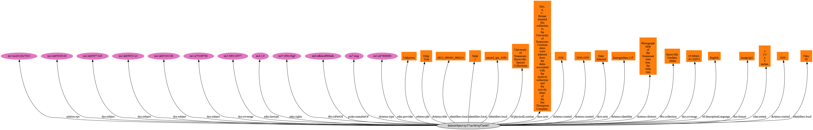
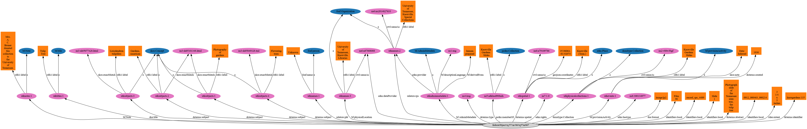

Modelling a UTK MODS File Based on the Samvera MODS to RDF Recommendations
==========================================================================

The Samvera MODS to RDF Working Group's `MODS to RDF Mapping Recommendations <https://wiki.duraspace.org/download/attachments/87460857/MODS-RDF-Mapping-Recommendations_SMIG_v1_2019-01.pdf?api=v2>`_
is divided into two sections: Direct Mappings and Minted Objects Mappings.  This document illustrates how one of our
XML files may look if we followed these mappings out-of-the-box.

For the purposes of this exercise, our group decided to use the MODS file for `knoxgardens:115 <https://digital.lib.utk.edu/collections/islandora/object/knoxgardens%3A115/datastream/MODS>`_.

The working group document states:

    In some cases within the direct or minted mappings there may be multiple ways that an element or value can be mapped, or multiple options are provided. Institutions should create and maintain a local application profile to document the approach that works best for their own data, applications, and user needs.

For the purposes of this exercise, I will be blindly following these two documents and ignoring that this specific metadata
record may have elements where it may make sense to handle something a different way.

Direct Mapping
--------------

If we followed the direct objects mapping, our RDF would be much simpler but we'd lose some things.

.. code-block:: turtle
    :linenos:
    :caption: RDF following Direct Mappings Option
    :name: RDF following Direct Mappings Option

    @prefix fedoraObject: <http://[LocalFedoraRepository]/> .
    @prefix identifiers: <http://id.loc.gov/vocabulary/identifiers> .
    @prefix dcterms: <http://purl.org/dc/terms/> .
    @prefix skos: <http://www.w3.org/2004/02/skos/core#> .
    @prefix edm: <http://www.europeana.eu/schemas/edm/> .
    @prefix rdau: <http://rdaregistry.info/Elements/u/#> .
    @prefix dce: <http://purl.org/dc/elements/1.1/> .
    @prefix relators: <http://id.loc.gov/vocabulary/relators> .
    @prefix bf: <http://id.loc.gov/ontologies/bibframe/> .
    @prefix pcdm: <http://pcdm.org/models#> .
    @prefix dbo: <http://dbpedia.org/ontology/> .

    <fedoraObject:tq/57/nr/06/tq57nr067>
        identifiers:local "0012_000463_000214", "record_spc_4489", "Slide 1", "Film 96" ;
        dcterms:identifier "knoxgardens:115" ;
        dcterms:title "Tulip Tree" ;
        dcterms:abstract "Photograph slide of the Tennessee state tree, the tulip tree" ;
        dcterms:created "1930-1939", "1930", "1939" ;
        skos:note "Date: Inferred" ;
        edm:hastype <http://vocab.getty.edu/aat/300134977> ;
        rdau:extent "3 1/4 x 5 inches" ;
        dce:format "image/jp2" ;
        relators:pht "Unknown" ;
        dbo:collection "Knoxville Gardens Slides" ;
        dbo:isPartOf <https://n2t.net/ark:/87290/v88w3bgf> ;
        dcterms:type <http://id.loc.gov/vocabulary/resourceTypes/img> ;
        dce:subject <http://id.loc.gov/authorities/subjects/sh85101348>, <http://id.loc.gov/authorities/subjects/sh85053123>, <http://id.loc.gov/authorities/subjects/sh85077428>, <http://id.loc.gov/authorities/subjects/sh85049328>;
        dce:coverage <http://id.loc.gov/authorities/names/n79109786>, "35.96064, -83.92074" ;
        skos:note "Mrs. A. C. Bruner donated this collection to the University of Tennessee. Creation dates were inferred from the dates associated with the archival collection and the activity dates of the Jim Thompson Company." ;
        relators:rps <http://id.loc.gov/authorities/names/no2014027633> ;
        bf:physicalLocation "University of Tennessee, Knoxville. Special Collections" ;
        pcdm:memberOf <fedoraObject:jk/88/99/adklasd908ads> ;
        bf:descriptionLanguage "English" ;
        edm:provider <http://id.loc.gov/authorities/names/n87808088> ;
        edm:rights <http://rightsstatements.org/vocab/CNE/1.0/> .

Here is a visualization of this data:

    Click the Image to Zoom In.

==========
identifier
==========

The direct mappings options have limited suggestions, but it does say that you should include the primary system identifier
as `dcterms:identifier` and `identifiers:local` for other local identifiers. It's worth thinking about whether this pid
would continue to be the primary system identifier post migration.

.. code-block:: turtle

    @prefix fedoraObject: <http://[LocalFedoraRepository]/> .
    @prefix identifiers: <http://id.loc.gov/vocabulary/identifiers> .
    @prefix dcterms: <http://purl.org/dc/terms/> .

    <fedoraObject:tq/57/nr/06/tq57nr067>
        identifiers:local "0012_000463_000214", "record_spc_4489", "Slide 1", "Film 96" ;
        dcterms:identifier "knoxgardens:115" .

=========
titleInfo
=========

With the direct mappings object, the main title should be mapped with `dcterms:title`.

.. code-block:: turtle

    @prefix fedoraObject: <http://[LocalFedoraRepository]/> .
    @prefix dcterms: <http://purl.org/dc/terms/> .

    <fedoraObject:tq/57/nr/06/tq57nr067>
                dcterms:title "Tulip Tree" .

========
abstract
========

All abstracts are mapped to dcterms:abstract.

.. code-block:: turtle

    @prefix dcterms: <http://purl.org/dc/terms/> .
    @prefix fedoraObject: <http://[LocalFedoraRepository]/> .

    <fedoraObject:tq/57/nr/06/tq57nr067>
        dcterms:abstract "Photograph slide of the Tennessee state tree, the tulip tree" .

==========
originInfo
==========

Use `dcterms:created` to represent the date of creation (<mods:dateCreated>) for the object, formatted as an
EDTF​ string.

.. code-block:: turtle

    @prefix fedoraObject: <http://[LocalFedoraRepository]/> .
    @prefix dcterms: <http://purl.org/dc/terms/> .

    <fedoraObject:tq/57/nr/06/tq57nr067>
        dcterms:created "1930-1939", "1930", "1939" .

===================
physicalDescription
===================

Also, there is an explanation for why you should not use dcterms:extent:

    The use of relatively obscure predicates for <mods:extent> is due to the fact that
    the defined range for dcterms:extent (the most obvious mapping) does not allow literal values; the
    mapping was chosen by a vote from the wider community in October 2016. Survey results can be found
    `here​ <https://docs.google.com/spreadsheets/d/1myLYmUoOX5i1FKBjDat39ZR8cEZ644lATNj6juCQ5xA/edit#gid=43534480>`_.

.. code-block:: xml

    <physicalDescription>
      <form authority="aat" valueURI="http://vocab.getty.edu/aat/300134977">lantern slides</form>
      <extent>3 1/4 x 5 inches</extent>
      <internetMediaType>image/jp2</internetMediaType>
    </physicalDescription>

.. code-block:: turtle

    @prefix fedoraObject: <http://[LocalFedoraRepository]/> .
    @prefix edm: <http://www.europeana.eu/schemas/edm/> .
    @prefix rdau: <http://rdaregistry.info/Elements/u/#> .
    @prefix dce: <http://purl.org/dc/elements/1.1/> .

    <fedoraObject:tq/57/nr/06/tq57nr067>
        edm:hastype <http://vocab.getty.edu/aat/300134977> ;
        rdau:extent "3 1/4 x 5 inches" ;
        dce:format "image/jp2" .

====
name
====

From the docs:

    Direct mappings for <mods:name> are possible without losing too much detail from MODS. MARC
    Relator terms can be used for roles when a role @authority or @authorityURI are provided. Values for
    MARC Relator terms can be either URIs or text. If no <mods:role> is provided, then dce:creator or
    dce:contributor are the recommended predicates to use. <mods:affiliation> is not mapped and
    <mods:namePart> is not specifically mapped (name parts are combined if the text version of the name
    is used). Any specific order for names provided in MODS will be lost in a simple RDF mapping.

Use relators:[term] with a role from MARC Code List of Relators role terms. Value is either text or URI from a controlled
vocabulary (like Library of Congress Name Authority File).

.. code-block:: turtle

    @prefix relators: <http://id.loc.gov/vocabulary/relators> .
    @prefix fedoraObject: <http://[LocalFedoraRepository]/> .

    <fedoraObject:tq/57/nr/06/tq57nr067>
        relators:pht "Unknown" .

=======
subject
=======

Use dce:subject for name and topical subjects. Use of a URI froma controlled subject vocabulary is preferred over a
literal value.

Use for geographic subjects. Use of a URI from a controlled vocabulary is preferred over a literal value.
Coordinate values should be formatted as a ​ DCMI Point​ or a ​ DCMI Box​.

.. code-block:: turtle

    @prefix fedoraObject: <http://[LocalFedoraRepository]/> .
    @prefix edm: <http://www.europeana.eu/schemas/edm/> .
    @prefix rdau: <http://rdaregistry.info/Elements/u/#> .
    @prefix dce: <http://purl.org/dc/elements/1.1/> .

    <fedoraObject:tq/57/nr/06/tq57nr067>
        dce:subject <http://id.loc.gov/authorities/subjects/sh85101348>, <http://id.loc.gov/authorities/subjects/sh85053123>, <http://id.loc.gov/authorities/subjects/sh85077428>, <http://id.loc.gov/authorities/subjects/sh85049328>;
        dce:coverage <http://id.loc.gov/authorities/names/n79109786>, "35.96064, -83.92074" .

====
note
====

From the docs:

    MODS utilizes attributes to differentiate note types, (for example <mods:note type="language">).
    However, in a direct mapping, this attribute is not represented in the predicate itself, but prepended to
    the note text. For context and clarity, these guidelines recommend using system logic to prepend the
    note type to the note value.

    Use skos:note for the note value.

.. code-block:: turtle

    @prefix fedoraObject: <http://[LocalFedoraRepository]/> .
    @prefix skos: <http://www.w3.org/2004/02/skos/core#> .

    <fedoraObject:tq/57/nr/06/tq57nr067>
    skos:note "Mrs. A. C. Bruner donated this collection to the University of Tennessee. Creation dates were inferred from the dates associated with the archival collection and the activity dates of the Jim Thompson Company." ;

==============
typeOfResource
==============

This element does not have a minted objects mapping.

The direct options mapping says to use dcterms:type but its range is rdfs:Class which requires you to use a URI.

They say to use either the:

1. `Resource Types Scheme <http://id.loc.gov/vocabulary/resourceTypes.html>`_
2. `DCMI Type Vocabulary <https://www.dublincore.org/specifications/dublin-core/dcmi-type-vocabulary/2000-07-11/>`_

Since there is a direct match in option one, I'm using it.

.. code-block:: xml

    <typeOfResource>still image</typeOfResource>

.. code-block:: turtle

    @prefix fedoraObject: <http://[LocalFedoraRepository]/> .
    @prefix dcterms: <http://purl.org/dc/terms/> .

    <fedoraObject:tq/57/nr/06/tq57nr067>
        dcterms:type <http://id.loc.gov/vocabulary/resourceTypes/img> .

===========
relatedItem
===========

From the docs:

    WARNING: Direct mappings for this element are complicated by the fact that <mods:relatedItem> "is a
    container element under which any MODS element may be used as a subelement" (​ MODS
    documentation​ ). For this reason, we ​ strongly ​ encourage the use of the ​ minted object mapping option
    for this element, in which minted objects for physical collections, series, subseries, and related works
    are described. This option is necessary if further nested series levels (subsubseries, etc.) are needed,
    and provides possibilities for more granular description of related objects.

In our sample, we have two stanzas (physical and digital):

.. code-block:: xml

    <relatedItem displayLabel="Project" type="host">
      <titleInfo>
         <title>Knoxville Garden Slides</title>
      </titleInfo>
    </relatedItem>
    <relatedItem displayLabel="Collection" type="host">
      <titleInfo>
         <title>Knoxville Gardens Slides</title>
      </titleInfo>
      <identifier>MS.1324</identifier>
      <location>
         <url>https://n2t.net/ark:/87290/v88w3bgf</url>
      </location>
    </relatedItem>

Use dbo:collection for the physical/source collection the item belongs to, if the value is a string literal.

Use dbo:isPartOf for the physical/source collection the item belongs to, if the value is a URI.

Use pcdm:isMemberOf to indicate the digital collection the item belongs to.

Use identifiers:[type] for an identifier corresponding to a parent item that the item being described belongs to. [Type] should be
replaced with the corresponding identifier type abbreviation from
`Library of Congress ​Standard Identifier Schemes​ <http://id.loc.gov/vocabulary/identifiers.html>`_.

.. code-block:: turtle

    @prefix fedoraObject: <http://[LocalFedoraRepository]/> .
    @prefix dbo: <http://dbpedia.org/ontology/> .
    @prefix pcdm: <http://pcdm.org/models#> .

    <fedoraObject:tq/57/nr/06/tq57nr067>
        pcdm:memberOf <fedoraObject:jk/88/99/adklasd908ads> ;
        dbo:collection "Knoxville Gardens Slides" ;
        dbo:isPartOf <https://n2t.net/ark:/87290/v88w3bgf> .

========
location
========

Mappings for the physical and online locations of the object being described and its digital surrogate.

Use relators:rps for <mods:physicalLocation> values, preferably using a URI for the organization from a controlled vocabulary
such as VIAF of Library of Congress Real World Objects.

.. code-block:: xml

    <location>
      <physicalLocation valueURI="http://id.loc.gov/authorities/names/no2014027633">University of Tennessee, Knoxville. Special Collections</physicalLocation>
    </location>

.. code-block:: turtle

    @prefix fedoraObject: <http://[LocalFedoraRepository]/> .
    @prefix relators: <http://id.loc.gov/vocabulary/relators> .

    <fedoraObject:tq/57/nr/06/tq57nr067>
        relators:rps <http://id.loc.gov/authorities/names/no2014027633> .

==========
recordInfo
==========

From the docs:

    WARNING: The predicates below from the BIBFRAME vocabulary are intended to describe an object
    with the class bf:adminMetadata rather than an intellectual, academic, or cultural heritage object. The
    usage recommended below is therefore questionable. However, since the group was unable to find
    other predicates representing these concepts, and because there is often a lack of distinction between
    a digital object and its metadata in many digital asset management systems, we have included the
    mappings here.

Here is our XML:

.. code-block:: xml

    <recordInfo>
      <recordContentSource valueURI="http://id.loc.gov/authorities/names/n87808088">University of Tennessee, Knoxville. Libraries</recordContentSource>
      <languageOfCataloging>
         <languageTerm type="text" authority="iso639-2b">English</languageTerm>
      </languageOfCataloging>
    </recordInfo>

Use edm:dataprovider for the organization responsible for creating the metadata record. Only used where this value may
need to be differentiated from the institution managing the repository.

Use edm:provider for the organization responsible for making the metadata record and/or digital object available.

Use bf:descriptionLanguage for the language of cataloging, preferably from a controlled vocabulary, such as ​
`ISO 639-2​ <http://id.loc.gov/vocabulary/iso639-2.html>`_.

.. code-block:: turtle

    @prefix edm: <http://www.europeana.eu/schemas/edm/> .
    @prefix fedoraObject: <http://[LocalFedoraRepository]/> .
    @prefix bf: <http://id.loc.gov/ontologies/bibframe/> .

    <fedoraObject:tq/57/nr/06/tq57nr067>
        bf:descriptionLanguage "English" ;
        edm:provider <http://id.loc.gov/authorities/names/n87808088> .

===============
accessCondition
===============

Since we have a rightsstatements.org URI, we should use `edm:rights`.

.. code-block:: xml

    <accessCondition type="use and reproduction"
                    xlink:href="http://rightsstatements.org/vocab/CNE/1.0/">
        Copyright Not Evaluated
    </accessCondition>

.. code-block:: turtle

    @prefix fedoraObject: <http://[LocalFedoraRepository]/> .
    @prefix edm: <http://www.europeana.eu/schemas/edm/> .

    <fedoraObject:tq/57/nr/06/tq57nr067>
        edm:rights <http://rightsstatements.org/vocab/CNE/1.0/> .

Minted Objects Mappings
-----------------------

If we followed the minted objects mapping, our sample metadata may look something like this as RDF:

.. code-block:: turtle
    :linenos:
    :caption: RDF following Minted Objects Mapping
    :name: RDF following Minted Objects Mapping

    @prefix fedoraObject: <http://[LocalFedoraRepository]/> .
    @prefix utkevents: <http://[address-to-triplestore]/events/> .
    @prefix utktitles: <http://[address-to-triplestore]/titles/> .
    @prefix utksubjects: <http://[address-to-triplestore]/subjects/> .
    @prefix utkspatial: <http://[address-to-triplestore]/spatial/> .
    @prefix utknotes: <http://[address-to-triplestore]/notes/> .
    @prefix utkphysicalcollections: <http://[address-to-triplestore]/physicalcollections/> .
    @prefix utknames: <http://[address-to-triplestore]/names/> .
    @prefix utkadminmetadata: <http://[address-to-triplestore]/utkadminmetadata/> .
    @prefix rdfs: <https://www.w3.org/TR/rdf-schema/> .
    @prefix skos: <http://www.w3.org/2004/02/skos/core#> .
    @prefix dcterms: <http://purl.org/dc/terms/> .
    @prefix bf: <http://id.loc.gov/ontologies/bibframe/> .
    @prefix relators: <http://id.loc.gov/vocabulary/relators> .
    @prefix skos: <http://www.w3.org/2004/02/skos/core#> .
    @prefix geojson: <https://purl.org/geojson/vocab#> .
    @prefix pcdm: <http://pcdm.org/models#> .
    @prefix dbo: <http://dbpedia.org/ontology/> .
    @prefix identifiers: <http://id.loc.gov/vocabulary/identifiers> .
    @prefix edm: <http://www.europeana.eu/schemas/edm/> .
    @prefix rdau: <http://rdaregistry.info/Elements/u/#> .
    @prefix foaf: <http://xmlns.com/foaf/0.1/> .
    @prefix dcmitype: <http://purl.org/dc/dcmitype/> .
    @prefix owl: <https://www.w3.org/2002/07/owl#> .
    @prefix dce: <http://purl.org/dc/elements/1.1/> .

    <fedoraObject:tq/57/nr/06/tq57nr067>
        dce:title <utktitles:1> ;
        identifiers:local "0012_000463_000214", "record_spc_4489", "Slide 1", "Film 96" ;
        dcterms:identifier "knoxgardens:115" ;
        dcterms:abstract "Photograph slide of the Tennessee state tree, the tulip tree" ;
        bf:provisionActivity <utkevents:1> ;
        edm:hastype <http://vocab.getty.edu/aat/300134977> ;
        rdau:extent "3 1/4 x 5 inches" ;
        dce:format "image/jp2" ;
        relators:pht <utknames:1> ;
        dcterms:subject <utksubjects:1>, <utksubjects:2>, <utksubjects:3>, <utksubjects:4> ;
        dcterms:spatial <utkspatial:1> ;
        bf:Note <utknotes:1> ;
        dcterms:type <http://id.loc.gov/vocabulary/resourceTypes/img> ;
        pcdm:memberOf <fedoraObject:jk/88/99/adklasd908ads> ;
        dcmitype:Collection <utkphysicalcollections:1>;
        relators:rps <utknames:2> ;
        bf:physicalLocation <utknames:3> ;
        bf:AdminMetadata <utkadminmetadata:1> ;
        edm:dataProvider <http://id.loc.gov/authorities/names/n87808088> ;
        edm:rights <http://rightsstatements.org/vocab/CNE/1.0/> .

    <utktitles:1>
        a bf:title ;
        rdfs:label "Tulip Tree" .

    <utkevents:1>
        a bf:provisionActivity ;
        dcterms:created "1930" ;
        skos:note "Date: Inferred" .

    <utknames:1>
        a foaf:person ;
        foaf:name "Unknown" .

    <utksubjects:1>
        a skos:Concept ;
        rdfs:label "Photography of gardens";
        skos:exactMatch <http://id.loc.gov/authorities/subjects/sh85101348.html> .

    <utksubjects:2>
        a skos:Concept ;
        rdfs:label "Gardens, American";
        skos:exactMatch <http://id.loc.gov/authorities/subjects/sh85101348.html> .

    <utksubjects:3>
        a skos:Concept ;
        rdfs:label "Liriodendron tulipifera";
        skos:exactMatch <http://id.loc.gov/authorities/subjects/sh85077428.html> .

    <utksubjects:4>
        a skos:Concept ;
        rdfs:label "Flowering trees";
        skos:exactMatch <http://id.loc.gov/authorities/subjects/sh85049328.tml> .

    <utkspatial:1>
        a edm:Place ;
        rdfs:label "Knoxville (Tenn.)" ;
        owl:sameAs <http://id.loc.gov/authorities/names/n79109786> ;
        geojson:coordinates "35.96064, -83.92074" .

    <utknotes:1>
        a bf:Note ;
        rdfs:label "Mrs. A. C. Bruner donated this collection to the University of Tennessee. Creation dates were inferred from the dates associated with the archival collection and the activity dates of the Jim Thompson Company." .

    <fedoraObject:jk/88/99/adklasd908ads>
        a pcdm:Collection ;
        rdfs:label "Knoxville Gardens Slides" .

    <utkphysicalcollections:1>
        a dcmitype:Collection ;
        rdfs:label "Knoxville Gardens Slides" ;
        owl:sameAs <https://n2t.net/ark:/87290/v88w3bgf> .

    <utknames:2>
        a foaf:Organization ;
        rdfs:label "University of Tennessee, Knoxville. Special Collections" ;
        owl:sameAs <http://id.loc.gov/authorities/names/no2014027633> .

    <utknames:3>
        a foaf:Organization;
        rdfs:label "University of Tennessee, Knoxville. Libraries" ;
        owl:sameAs <http://id.loc.gov/authorities/names/n87808088>.

    <utkadminmetadata:1>
        a bf:AdminMetadata ;
        edm:provider <utknames:2> ;
        bf:derivedFrom "human prepared" ;
        bf:descriptionLanguage <http://id.loc.gov/vocabulary/iso639-2/eng> .

You can see a visualization of this here (but you'll need to zoom in by clicking the object to understand):

    Click to Zoom In

=========
titleInfo
=========

In the Samvera documenation, they do not have a titleInfo that is this simple in their minted objects example.
Because of this, I think it'd be a waste to mint an object for a title like this.  But, because of the assignment, I
wanted to show what a minted title may look like for this record.

.. code-block:: turtle

    @prefix bf: <http://id.loc.gov/ontologies/bibframe/> .
    @prefix rdfs: <https://www.w3.org/TR/rdf-schema/> .

    <utktitles:1>
        a bf:title ;
        rdfs:label "Tulip Tree" .

==========
identifier
==========

There is no minted objects examples for identifiers in the Samvera documentation.  For that reason, I'm following the
direct mappings option.

The direct mappings options have limited suggestions, but it does say that you should include the primary system identifier
as `dcterms:identifier` and `identifiers:local` for other local identifiers. It's worth thinking about whether this pid
would continue to be the primary system identifier post migration.

.. code-block:: turtle

    @prefix fedoraObject: <http://[LocalFedoraRepository]/> .
    @prefix identifiers: <http://id.loc.gov/vocabulary/identifiers> .
    @prefix dcterms: <http://purl.org/dc/terms/> .

    <fedoraObject:tq/57/nr/06/tq57nr067>
        identifiers:local "0012_000463_000214", "record_spc_4489", "Slide 1", "Film 96" ;
        dcterms:identifier "knoxgardens:115" .

========
abstract
========

There is no minted objects mapping.  They suggest using `dcterms:abstract` for everything:

.. code-block:: turtle

    @prefix dcterms: <http://purl.org/dc/terms/> .
    @prefix fedoraObject: <http://[LocalFedoraRepository]/> .

    <fedoraObject:tq/57/nr/06/tq57nr067>
        dcterms:abstract "Photograph slide of the Tennessee state tree, the tulip tree" .

==========
originInfo
==========

The MODS to RDF working group doc states:

    In this mapping, the concept of origination (publication, manufacture, distribution, etc.) is represented
    by an ProvisionActivity object defined by the BIBFRAME ontology (or one of it's subclasses). Using this
    option allows multiple publishers, places of publication, or <originInfo> types to be described with
    greater clarity and precision.

There document also states the following about dates:

    These examples do not include the use of datatypes to qualify string values for dates. If datatypes are desired,
    best practice would be to use datatypes from the Library of Congress Extended Date/Time Format Datatypes
    Scheme. (Example: "1930"^^<http://id.loc.gov/datatypes/edtf/EDTF-level0>)

While we have 3 dateCreated nodes, they're all related to the same event.  Thus we should only have one provision activity,
and following their guidelines it should be formatted like this:

.. code-block:: xml
    :caption: XML node for originInfo
    :name: XML node for originInfo

    <originInfo>
          <dateCreated qualifier="inferred">1930-1939</dateCreated>
          <dateCreated encoding="edtf"
                       point="start"
                       qualifier="inferred"
                       keyDate="yes">1930</dateCreated>
          <dateCreated encoding="edtf" point="end" qualifier="inferred">1939</dateCreated>
    </originInfo>

.. code-block:: turtle
    :caption: Converting originInfo to RDF
    :name: Converting originInfo to RDF

    @prefix bf: <http://id.loc.gov/ontologies/bibframe/> .
    @prefix skos: <http://www.w3.org/2004/02/skos/core#> .
    @prefix dcterms: <http://purl.org/dc/terms/> .
    @prefix utkevents: <http://[address-to-triplestore]/events/> .
    @prefix fedoraObject: <http://[LocalFedoraRepository]/> .

    <fedoraObject:tq/57/nr/06/tq57nr067>
        bf:provisionActivity <utkevents:1> .

    <utkevents:1>
        a bf:provisionActivity ;
        dcterms:created "1930/1939" ;
        skos:note "Date: Inferred" .

===================
physicalDescription
===================

This element does not have a minted objects mapping.

Also, there is an explanation for why you should not use dcterms:extent:

    The use of relatively obscure predicates for <mods:extent> is due to the fact that
    the defined range for dcterms:extent (the most obvious mapping) does not allow literal values; the
    mapping was chosen by a vote from the wider community in October 2016. Survey results can be found
    `here​ <https://docs.google.com/spreadsheets/d/1myLYmUoOX5i1FKBjDat39ZR8cEZ644lATNj6juCQ5xA/edit#gid=43534480>`_.

.. code-block:: xml
    :caption: physicalDescription as an XML node
    :name: physicalDescription as an XML node

    <physicalDescription>
      <form authority="aat" valueURI="http://vocab.getty.edu/aat/300134977">lantern slides</form>
      <extent>3 1/4 x 5 inches</extent>
      <internetMediaType>image/jp2</internetMediaType>
    </physicalDescription>

.. code-block:: turtle

    @prefix fedoraObject: <http://[LocalFedoraRepository]/> .
    @prefix edm: <http://www.europeana.eu/schemas/edm/> .
    @prefix rdau: <http://rdaregistry.info/Elements/u/#> .
    @prefix dce: <http://purl.org/dc/elements/1.1/> .

    <fedoraObject:tq/57/nr/06/tq57nr067>
        edm:hastype <http://vocab.getty.edu/aat/300134977> ;
        rdau:extent "3 1/4 x 5 inches" ;
        dce:format "image/jp2" .

====
name
====

Our example here is poor, and I'd argue we should not mint this but treat "Unknown" as a literal value always and
never a minted object. If not, we create an object that is prolific.  That being said, I'm minting an object for this
example.

It's important to note that their documentation states:

    It should be noted that most examples using the Library of Congress Name Authority File (LCNAF) are
    pointing to Real World Object URIs (rwo) instead of the authorities URI. The common practice has been
    to record the authorities URI for names from LCNAF but these records have been enhanced to include
    a real world object URI that reflects a more accurate representation of the person, family, or
    organization as a Person or Organization and not just an authority record.

That being said, we have a very bad example to work from for showing a minted object for this sample record:

.. code-block:: xml
    :caption: XML Stanza for our MODS Name
    :name: XML Stanza for our MODS Name

    <name>
      <namePart>Unknown</namePart>
      <role>
         <roleTerm authority="marcrelator"
                   valueURI="http://id.loc.gov/vocabulary/relators/pht">Photographer</roleTerm>
      </role>
    </name>

.. code-block:: turtle
    :caption: Minting a Name Object
    :name: Minting a Name Object

    @prefix utknames: <http://[address-to-triplestore]/names/> .
    @prefix fedoraObject: <http://[LocalFedoraRepository]/> .

    <fedoraObject:tq/57/nr/06/tq57nr067>
        relators:pht <utknames:1> .

    <utknames:1>
        a foaf:person ;
        foaf:name "Unknown" .

=======
subject
=======

Following the minted objects rules from Samvera is difficult because their examples assume everything is in one
subject stanza.

Their documentation also states:

    For complex LCSH-style subjects with multiple subdivisions, the full subject string (including hyphens)
    is designated with skos:prefLabel, preserving the original subject heading from MODS XML. Each
    <subject> sub-element is also represented by an rdfs:label attribute on the minted subject object.
    Additional subject facet components such as temporal or geographic subdivisions may be represented
    by additional minted subjects as needed to allow for temporal or geographic indexing, browsing, and/or
    display functionality.

That being said, here is my attempt to translate their recommendations for minting subject objects.  Note that the docs
state to use dcterms:subject for topics and names and dcterms:spatial for geographic.

.. code-block:: xml
    :caption: XML Stanza for our MODS Subjects
    :name: XML Stanza for our MODS Subjects

    <subject authority="lcsh"
            valueURI="http://id.loc.gov/authorities/subjects/sh85101348">
      <topic>Photography of gardens</topic>
    </subject>
    <subject authority="lcsh"
            valueURI="http://id.loc.gov/authorities/subjects/sh85053123">
      <topic>Gardens, American</topic>
    </subject>
    <subject authority="lcsh"
            valueURI="http://id.loc.gov/authorities/subjects/sh85077428">
      <topic>Liriodendron tulipifera</topic>
    </subject>
    <subject authority="lcsh"
            valueURI="http://id.loc.gov/authorities/subjects/sh85049328">
      <topic>Flowering trees</topic>
    </subject>
    <subject authority="naf"
            valueURI="http://id.loc.gov/authorities/names/n79109786">
      <geographic>Knoxville (Tenn.)</geographic>
      <cartographics>
         <coordinates>35.96064, -83.92074</coordinates>
      </cartographics>
    </subject>

.. code-block:: turtle
    :caption: Minting Subject Objects
    :name: Minting Subject Objects

    @prefix fedoraObject: <http://[LocalFedoraRepository]/> .
    @prefix utksubjects: <http://[address-to-triplestore]/subjects/> .
    @prefix owl: <https://www.w3.org/2002/07/owl#> .
    @prefix rdfs: <https://www.w3.org/TR/rdf-schema/> .
    @prefix skos: <http://www.w3.org/2004/02/skos/core#> .
    @prefix geojson: <https://purl.org/geojson/vocab#> .
    @prefix utkspatial: <http://[address-to-triplestore]/spatial/> .

    <fedoraObject:tq/57/nr/06/tq57nr067>
        dcterms:spatial <utkspatial:1> ;
        dcterms:subject <utksubjects:1>, <utksubjects:2>, <utksubjects:3>, <utksubjects:4> .

    <utksubjects:1>
        a skos:Concept ;
        rdfs:label "Photography of gardens";
        skos:exactMatch <http://id.loc.gov/authorities/subjects/sh85101348.html> .

    <utksubjects:2>
        a skos:Concept ;
        rdfs:label "Gardens, American";
        skos:exactMatch <http://id.loc.gov/authorities/subjects/sh85101348.html> .

    <utksubjects:3>
        a skos:Concept ;
        rdfs:label "Liriodendron tulipifera";
        skos:exactMatch <http://id.loc.gov/authorities/subjects/sh85077428.html> .

    <utksubjects:4>
        a skos:Concept ;
        rdfs:label "Flowering trees";
        skos:exactMatch <http://id.loc.gov/authorities/subjects/sh85049328.tml> .

    <utkspatial:1>
        a edm:Place ;
        rdfs:label "Knoxville (Tenn.)" ;
        owl:sameAs <http://id.loc.gov/authorities/names/n79109786> ;
        geojson:coordinates "35.96064, -83.92074" .

====
note
====

According to Samvera docs:

    The minted object mapping allows note type values to be provided without having to be prepended to the note value.

.. code-block:: xml
    :caption: XML Stanza for note
    :name: XML Stanza for note

    <note>
        Mrs. A. C. Bruner donated this collection to the University of Tennessee. Creation dates were inferred from the dates associated with the archival collection and the activity dates of the Jim Thompson Company.
    </note>

.. code-block:: turtle
    :caption: Minting a Note Object
    :name: Minting a Note Object

    @prefix utknotes: <http://[address-to-triplestore]/notes/> .
    @prefix fedoraObject: <http://[LocalFedoraRepository]/> .
    @prefix rdfs: <https://www.w3.org/TR/rdf-schema/> .
    @prefix bf: <http://id.loc.gov/ontologies/bibframe/> .

    <fedoraObject:tq/57/nr/06/tq57nr067>
        bf:Note <utknotes:1> .

    <utknotes:1>
        a bf:Note ;
        rdfs:label "Mrs. A. C. Bruner donated this collection to the University of Tennessee. Creation dates were inferred from the dates associated with the archival collection and the activity dates of the Jim Thompson Company." .

==============
typeOfResource
==============

This element does not have a minted objects mapping.

The direct options mapping says to use dcterms:type but its range is rdfs:Class which requires you to use a URI.

They say to use either the:

1. `Resource Types Scheme <http://id.loc.gov/vocabulary/resourceTypes.html>`_
2. `DCMI Type Vocabulary <https://www.dublincore.org/specifications/dublin-core/dcmi-type-vocabulary/2000-07-11/>`_

Since there is a direct match in option one, I'm using it.

.. code-block:: xml
    :caption: XML Stanza for typeOfResource
    :name: XML Stanza for typeOfResource

    <typeOfResource>still image</typeOfResource>

.. code-block:: turtle
    :caption: RDF for typeOfResource
    :name: RDF for typeOfResource

    @prefix fedoraObject: <http://[LocalFedoraRepository]/> .
    @prefix dcterms: <http://purl.org/dc/terms/> .

    <fedoraObject:tq/57/nr/06/tq57nr067>
        dcterms:type <http://id.loc.gov/vocabulary/resourceTypes/img> .

===========
relatedItem
===========

The Samvera docs have a minted objects section for this that:

    focus(es) on use cases where <mods:relatedItem> is used to describe parent
    collections, series, and subseries; parent works that the work being described forms some part of; and
    constituent works that represent some part of the item being described. Relationships for digital
    collection membership are also described. These mappings were informed by a survey distributed to
    the wider community in January 2017. Survey results can be found
    ​`here​ <https://docs.google.com/spreadsheets/d/18JnrxIhIM5F17FWZ_i-JUckFDNHLENi0hRBMUJoNllc/edit#gid=170260270>`_.

In our sample, we have two stanzas (physical and digital):

.. code-block:: xml
    :caption: relatedItem Stanzas
    :name: relatedItem Stanzas

    <relatedItem displayLabel="Project" type="host">
      <titleInfo>
         <title>Knoxville Garden Slides</title>
      </titleInfo>
    </relatedItem>
    <relatedItem displayLabel="Collection" type="host">
      <titleInfo>
         <title>Knoxville Gardens Slides</title>
      </titleInfo>
      <identifier>MS.1324</identifier>
      <location>
         <url>https://n2t.net/ark:/87290/v88w3bgf</url>
      </location>
    </relatedItem>

Our turtle would look something like this:

.. code-block:: turtle
    :caption: RDF for relatedItems
    :name: RDF for relatedItems

    @prefix fedoraObject: <http://[LocalFedoraRepository]/> .
    @prefix utkphysicalcollections: <http://[address-to-triplestore]/physicalcollections/> .
    @prefix pcdm: <http://pcdm.org/models#> .
    @prefix dcmitype: <http://purl.org/dc/dcmitype/> .
    @prefix owl: <https://www.w3.org/2002/07/owl#> .
    @prefix rdfs: <https://www.w3.org/TR/rdf-schema/> .

    <fedoraObject:tq/57/nr/06/tq57nr067>
        pcdm:memberOf <fedoraObject:jk/88/99/adklasd908ads> ;
        dcmitype:Collection <utkphysicalcollections:1>.

    <utkphysicalcollections:1>
        a dcmitype:Collection ;
        rdfs:label "Knoxville Gardens Slides" ;
        owl:sameAs <https://n2t.net/ark:/87290/v88w3bgf> .

Note that the value of `pcdm:memberOf` should be the URI to it's new location and not a minted object.

========
location
========

The Samvera minted objects docs state:

    In some cases, it may be preferable to create an Organization object to capture data about the holding
    location (if there is no existing URI, for example). Examples using this pattern are shown below. These
    mappings were informed by a survey distributed to the wider community in August 2016. Survey results
    can be found ​ here​ with the options listed ​ here​ .

.. code-block:: xml
    :caption: XML Stanza for Location
    :name: XML Stanza for Location

    <location>
      <physicalLocation valueURI="http://id.loc.gov/authorities/names/no2014027633">University of Tennessee, Knoxville. Special Collections</physicalLocation>
    </location>

Since we have a URI for this, maybe we wouldn't mint this location, but I'm doing it regardless for the purposes of
demonstration:

.. code-block:: turtle
    :caption: RDF for Location
    :name: RDF for Location

    @prefix fedoraObject: <http://[LocalFedoraRepository]/> .
    @prefix owl: <https://www.w3.org/2002/07/owl#> .
    @prefix rdfs: <https://www.w3.org/TR/rdf-schema/> .
    @prefix utknames: <http://[address-to-triplestore]/names/> .
    @prefix relators: <http://id.loc.gov/vocabulary/relators> .
    @prefix foaf: <http://xmlns.com/foaf/0.1/> .

    <fedoraObject:tq/57/nr/06/tq57nr067>
        relators:rps <utknames:2> .

    <utknames:2>
        a foaf:Organization ;
        rdfs:label "University of Tennessee, Knoxville. Special Collections" ;
        owl:sameAs <http://id.loc.gov/authorities/names/no2014027633> .

==========
recordInfo
==========

According to the Samvera docs:

    The minted object mapping involves creating a new object to represent the metadata itself, and allows
    for creating objects to represent an institution, department, or other named entity that is responsible for
    the creation or publication of the metadata record. This may be needed in cases where there is no
    existing URI for the entity.

Our stanza for recordInfo looks like this:

.. code-block:: xml
    :caption: XML Stanza for recordInfo
    :name: XML Stanza for recordInfo

    <recordInfo>
      <recordContentSource valueURI="http://id.loc.gov/authorities/names/n87808088">University of Tennessee, Knoxville. Libraries</recordContentSource>
      <languageOfCataloging>
         <languageTerm type="text" authority="iso639-2b">English</languageTerm>
      </languageOfCataloging>
    </recordInfo>

Normally, this stanza would only represent who created the metadata, but we also use this to describe where a digital
object originated. Since I know this, I'm adding something here that doesn't come from the Samvera docs.

.. code-block:: turtle
    :caption: RDF for recordInfo
    :name: RDF for recordInfo
    :linenos:
    :emphasize-lines: 8

    @prefix fedoraObject: <http://[LocalFedoraRepository]/> .
    @prefix bf: <http://id.loc.gov/ontologies/bibframe/> .
    @prefix utkadminmetadata: <http://[address-to-triplestore]/utkadminmetadata/> .
    @prefix edm: <http://www.europeana.eu/schemas/edm/> .

    <fedoraObject:tq/57/nr/06/tq57nr067>
        bf:AdminMetadata <utkadminmetadata:1> ;
        edm:dataProvider <http://id.loc.gov/authorities/names/n87808088> .

    <utkadminmetadata:1>
        a bf:AdminMetadata ;
        edm:provider <utknames:2> ;
        bf:derivedFrom "human prepared" ;
        bf:descriptionLanguage <http://id.loc.gov/vocabulary/iso639-2/eng> .

Note that the range of edm:dataProvider is edm:Agent so what I'm doing here isn't allowed exactly. I'm adding it just
so we can start thinking about it.

===============
accessCondition
===============

AccessCondition does not have a minted objects mapping. Since we have a rightsstatements.org URI, we should use
`edm:rights`.

.. code-block:: xml
    :caption: XML Stanza for Access Condition
    :name: XML Stanza for Access Condition

    <accessCondition type="use and reproduction"
                    xlink:href="http://rightsstatements.org/vocab/CNE/1.0/">
        Copyright Not Evaluated
    </accessCondition>

.. code-block:: turtle

    @prefix fedoraObject: <http://[LocalFedoraRepository]/> .
    @prefix edm: <http://www.europeana.eu/schemas/edm/> .

    <fedoraObject:tq/57/nr/06/tq57nr067>
        edm:rights <http://rightsstatements.org/vocab/CNE/1.0/> .
